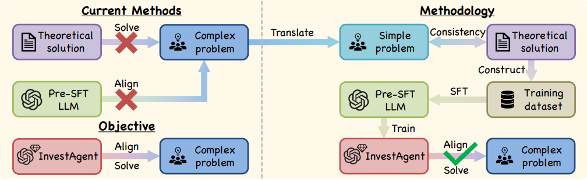

# InvestAlign

Official repository for **InvestAlign: Align LLMs with Investor Decision-Making under Herd Behavior** at [**NeurIPS 2024 Workshop AFM**](https://openreview.net/pdf?id=vqTknTkmVm)



Large Language Models (LLMs) can be leveraged to assist in solving complex
investment problems. However, the investment decisions generated by existing
LLMs often deviate from real-user data. One method to align LLMs with investor
decision-making processes is Supervised Fine-Tuning (SFT), which requires a
substantial amount of real-user data that is costly to collect and raises concerns
about privacy and security. In this work, we propose **InvestAlign**, an efficient
method that constructs large-scale SFT training datasets based on the theoretical
solution to a similar and simpler optimal investment problem, rather than the
original complex one. We theoretically demonstrate that fine-tuning LLMs with
these datasets leads to faster parameter convergence compared to using real-user
data. By fine-tuning LLMs, we obtain **InvestAgent**s, which align more with real-user data than pre-SFT LLMs in both the simple and original complex problems.
This highlights **InvestAlign** as a promising approach with the potential to address
complex optimal investment problems and align LLMs with investor decision-making processes in economics and finance.

### Install 

```
pip install -r requirements.txt
```

### LLM as investor

```
# Absolute herd behavior (P2)
bash scripts/infer_seq.sh
# Relative herd behavior (P1)
bash scripts/infer_seq_relative.sh
```